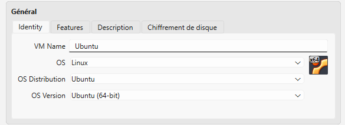
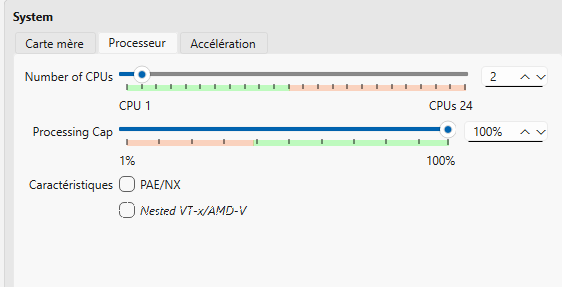

# Activité : Solution de virtualisation

## 1. Pourquoi la virtualisation en entreprise ?
L'objectif principal est d'éviter la multiplication des serveurs physiques. En virtualisant, on optimise l'utilisation des ressources d'une seule machine (CPU, RAM) pour faire tourner plusieurs environnements isolés.

### Les principales solutions du marché
Il existe plusieurs solutions professionnelles pour gérer la virtualisation :
* **VMware vSphere (ESXi) :** Le leader du marché pour les infrastructures d'entreprise.
* **Microsoft Hyper-V :** Très utilisé dans les environnements 100% Windows. *(celle utilisée au sein de mon entreprise )*
* **Proxmox VE :** Une solution open-source très populaire pour sa flexibilité.
* **Oracle VM VirtualBox :** Idéal pour le développement et les tests sur un poste de travail (la solution choisie pour ce rapport).

---

## 2. Mise en place de VirtualBox
Pour mon environnement d'apprentissage, j'ai installé VirtualBox. C'est un hyperviseur de type 2 (il s'installe comme un logiciel sur mon système Windows).
### Création et identité de la machine virtuelle

> [!NOTE]
> Pour installer Ubuntu, j'ai d'abord configuré l'identité de la machine dans VirtualBox. J'ai nommé la VM "Ubuntu" et sélectionné le type "Linux" avec la version "Ubuntu (64-bit)".

### Réglages principaux de la machine virtuelle
Lors de la création de la VM, j'ai dû configurer les ressources suivantes :
* **Processeur :** Allocation de 2 cœurs pour assurer la fluidité.
 

* **Mémoire vive (RAM) :** 3072 Mo (3 Go). (pour laisser assez de mémoire à Windows tout en permettant à Ubuntu de bien tourner).
* 
* **Stockage :** Création d'un disque dur virtuel dynamique (VDI) de 25 Go.

### Les types d'accès réseau
C'est un point crucial pour la communication de la machine :
* **NAT (Network Address Translation) :** La VM accède à Internet via l'hôte, mais elle est invisible de l'extérieur. C'est le réglage par défaut.
* **Accès par pont (Bridge) :** La VM est considérée comme une machine réelle sur le réseau local (elle a sa propre adresse IP comme mon PC).
* **Réseau privé hôte :** Permet de faire communiquer la VM uniquement avec mon PC Windows, sans accès Internet.

---

## 3. L'intérêt d'un "Instantané" (Snapshot)
L'instantané est l'un des outils les plus puissants de la virtualisation.

* **C'est quoi ?** C'est une "photo" de l'état de la machine virtuelle (fichiers, réglages, mémoire) à un instant T.
* **Pourquoi l'utiliser ?** Avant de faire une manipulation risquée ou une installation complexe, on prend un instantané. Si le système plante ou si l'on fait une erreur, on peut revenir à l'état exact de l'instantané en quelques secondes. C'est un "droit à l'erreur" permanent.

> **[📷 ICI : Capture d'écran de l'interface VirtualBox avec ma VM créée]**
