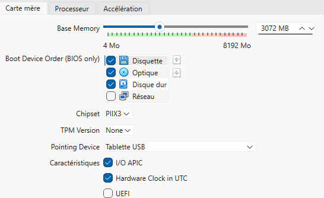
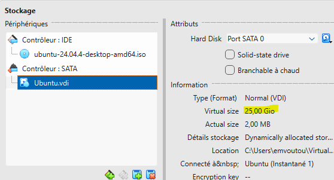
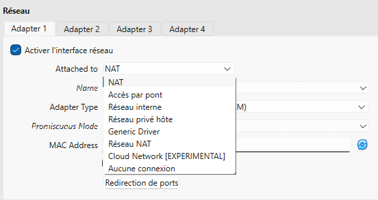

# Activité : Solution de virtualisation

## 1. Pourquoi la virtualisation en entreprise ?
L'objectif principal est d'éviter la multiplication des serveurs physiques. En virtualisant, on optimise l'utilisation des ressources d'une seule machine (CPU, RAM) pour faire tourner plusieurs environnements isolés.

### Les principales solutions du marché
Il existe plusieurs solutions professionnelles pour gérer la virtualisation :
* **VMware vSphere (ESXi) :** Le leader du marché pour les infrastructures d'entreprise.
* **Microsoft Hyper-V :** Très utilisé dans les environnements 100% Windows. *(celle utilisée au sein de mon entreprise )*
* **Proxmox VE :** Une solution open-source très populaire pour sa flexibilité.
* **Oracle VM VirtualBox :** Idéal pour le développement et les tests sur un poste de travail (la solution choisie pour ce rapport).

---

## 2. Mise en place de VirtualBox
Pour mon environnement d'apprentissage, j'ai installé VirtualBox. C'est un hyperviseur de type 2 (il s'installe comme un logiciel sur mon système Windows).
### Création et identité de la machine virtuelle

> [!NOTE]
> Pour installer Ubuntu, j'ai d'abord configuré l'identité de la machine dans VirtualBox. J'ai nommé la VM "Ubuntu" et sélectionné le type "Linux" avec la version "Ubuntu (64-bit)".

### Réglages principaux de la machine virtuelle
Lors de la création de la VM, j'ai dû configurer les ressources suivantes :
* **Processeur :** Allocation de 2 cœurs pour assurer la fluidité.
 

* **Mémoire vive (RAM) :** 3072 Mo (3 Go). (pour laisser assez de mémoire à Windows tout en permettant à Ubuntu de bien tourner).
 

> [!IMPORTANT]
> **Justification du choix de 3 Go :**
> - **Fluidité :** C'est le "juste milieu" pour qu'Ubuntu soit rapide sans ralentir Windows.
> - **Contrainte < 3 Go :** Le système Ubuntu risque d'être lent et de saccader.
> - **Contrainte > 3 Go :** En allouant 4 Go ou plus, je risque de saturer les 8 Go de mon PC, ce qui peut faire planter VirtualBox ou Windows.

* **Stockage :** Création d'un disque dur virtuel dynamique (VDI) de 25 Go.
 

> [!NOTE]
> J'ai configuré un disque au format **VDI** avec une **allocation dynamique**. 
> - **État final :** Le fichier `Ubuntu.vdi` est correctement rattaché au contrôleur SATA.
> - **Optimisation :** Ce mode permet de ne consommer que l'espace disque réellement utilisé par Ubuntu sur mon système hôte, tout en garantissant une capacité maximale de 25 Go.

### Les types d'accès réseau
Le choix du mode réseau détermine comment la machine virtuelle communique avec le monde extérieur :

* **NAT (Network Address Translation) :** La VM accède à Internet via l'hôte, mais elle est invisible de l'extérieur. C'est le réglage par défaut que j'ai conservé pour cette installation.
* **Accès par pont (Bridge) :** La VM est considérée comme une machine réelle sur le réseau local et possède sa propre adresse IP, comme mon PC physique.
* **Réseau privé hôte :** Permet de faire communiquer la VM uniquement avec mon PC Windows, sans accès Internet.
---

## 3. L'intérêt d'un "Instantané" (Snapshot)
L'instantané est l'un des outils les plus puissants de la virtualisation.

* **C'est quoi ?** C'est une "photo" de l'état de la machine virtuelle (fichiers, réglages, mémoire) à un instant T.
* **Pourquoi l'utiliser ?** Avant de faire une manipulation risquée ou une installation complexe, on prend un instantané. Si le système plante ou si l'on fait une erreur, on peut revenir à l'état exact de l'instantané en quelques secondes. C'est un "droit à l'erreur" permanent.

### Repères sur l'interface (surlignés en jaune) :

Sur la capture d'écran ci-dessus, on peut identifier les trois éléments clés pour gérer ses sauvegardes :

1.  **L'endroit pour faire un snapshot :** Le bouton **"Prendre"** situé en haut à gauche de la barre d'outils.
2.  **Le nom du snapshot :** Ici nommé **"Instantané 1"**. On remarque juste en dessous la mention *"État actuel (modifié)"*, ce qui prouve que des changements ont eu lieu depuis la capture.
3.  **Le moment (date) :** À droite, la colonne **"Pris"** indique précisément quand la photo a été prise (le **23/02/2026 à 12:27**), permettant de se situer dans le temps.
